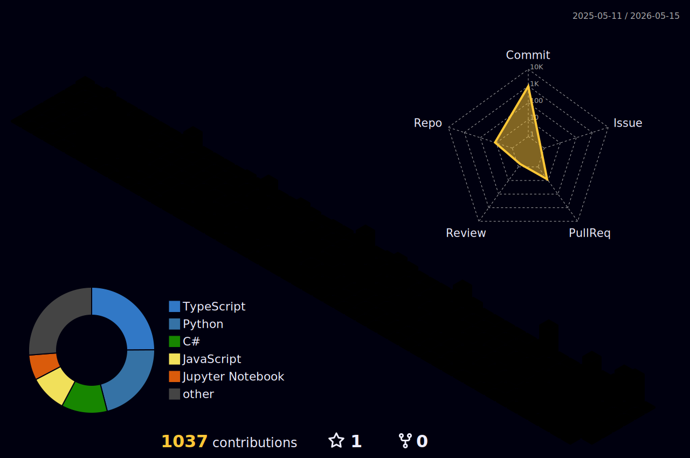

```
 ██╗   ██╗ ██████╗ ██╗   ██╗ ██████╗██╗  ██╗███████╗███╗   ██╗     ██╗██╗ █████╗ ███╗   ██╗  ██████╗ 
 ╚██╗ ██╔╝██╔═══██╗██║   ██║██╔════╝██║  ██║██╔════╝████╗  ██║     ██║██║██╔══██╗████╗  ██║ ██╔════╝ 
  ╚████╔╝ ██║   ██║██║   ██║██║     ███████║█████╗  ██╔██╗ ██║     ██║██║███████║██╔██╗ ██║ ██║  ███╗
   ╚██╔╝  ██║   ██║██║   ██║██║     ██╔══██║██╔══╝  ██║╚██╗██║██   ██║██║██╔══██║██║╚██╗██║ ██║   ██║
    ██║   ╚██████╔╝╚██████╔╝╚██████╗██║  ██║███████╗██║ ╚████║╚█████╔╝██║██║  ██║██║ ╚████║ ╚██████╔╝
    ╚═╝    ╚═════╝  ╚═════╝  ╚═════╝╚═╝  ╚═╝╚══════╝╚═╝  ╚═══╝ ╚════╝ ╚═╝╚═╝  ╚═╝╚═╝  ╚═══╝  ╚═════╝
```

<div align="center">


</div>

---

## [#] About Me

```bash
$ cat about_me.txt
```

> Master's student in **Information Management at National Central University** (Computer Network Security Laboratory). I focus on **cybersecurity** and **AI application implementation**, with hands-on experience in full-stack development, teaching & research, and agile team collaboration. I excel at transforming technology into practical solutions for commercial and educational scenarios.

- **[+] Education:**
  - **M.S. in Information Management** — National Central University *(Computer Network Security Laboratory)*
  - **B.S. in Information Management** — National Pingtung University *(Graduated early · Multiple Book Awards · 1st Place in Academic Excellence — Five Merits Award)*

- **[+] Experience:**
  - **Software Intern Engineer** — Titan Technology Singapore *(Agile development & cross-departmental communication)*
  - **Assistant Referee, Cybersecurity (Youth Category)** — WorldSkills Asia Competition
  - **Teaching Assistant** — Artificial Intelligence Programming / E-Commerce Security Management

- **[>] Core Focus:** Cybersecurity · AI Application Implementation · Full-Stack Development · Agile Project Management

---

## [#] Tech Stack & Tools

### [*] Security & Analysis


### [*] Cloud & Backend


### [*] AI & Data


### [*] Frontend & DevOps


---

## [#] Certifications

```
$ ls ~/certifications/
```

| Badge | Certification |
|-------|--------------|
| [>] | **ISC2 Certified in Cybersecurity (CC)** |
| [>] | **Mingyi Information Security Technology Certification** |
| [>] | **(EEC Enterprise E-Planner)** Information Security and Law |
| [>] | **(TQC+)** C Programming Language — 2nd Edition |
| [>] | **(TQC Enterprise E-Assistant Planner)** Introduction to E-Commerce |

---

## [#] Featured Projects

```
$ ls -la ~/projects/
```

| Project | Tech Stack | Description |
|---------|------------|-------------|
| **Yishen GYM — Fitness Booking Platform & Intelligent AI Customer Service** | Azure, LangServe, Azure OpenAI, Qdrant | Developed a C2C cross-platform booking system integrating coach and student information. Led cloud deployment on Azure App Service, and built a RAG-based intelligent customer service using the LangServe framework and Azure OpenAI to accurately answer user booking inquiries. |
| **POKE Elderly GO** — Aging Society Care APP | Firebase, Android, Agile | Developed a care APP with medication reminders and location tracking in response to Taiwan's aging trend. Responsible for UI design and managing the full Firebase ecosystem (Authentication, Cloud Firestore, Realtime Database); led the team to deliver on schedule under pressure using agile methodologies. |
| **AI Gesture Shooting Game** — Computer Vision & Real-Time Interaction | Python, OpenCV, Mediapipe, NumPy | Independently designed a somatosensory interactive game requiring no physical controllers. Captured video using Python & cv2, tracked hand knuckle positions in real time via Mediapipe, and calculated distances to accurately detect "shooting" gestures and trigger attack logic. |

---

## [#] GitHub Stats

<div align="center">



</div>

<div align="center"></div>

---

## [#] Contact Me

<div align="center">

[](https://www.linkedin.com/in/youchen-jiang/)

</div>

---

<div align="center">

```
[+] System Status: ONLINE
[+] Threat Level: MONITORING
[*] "The quieter you become, the more you are able to hear." — Kali Linux motto
```


</div>
